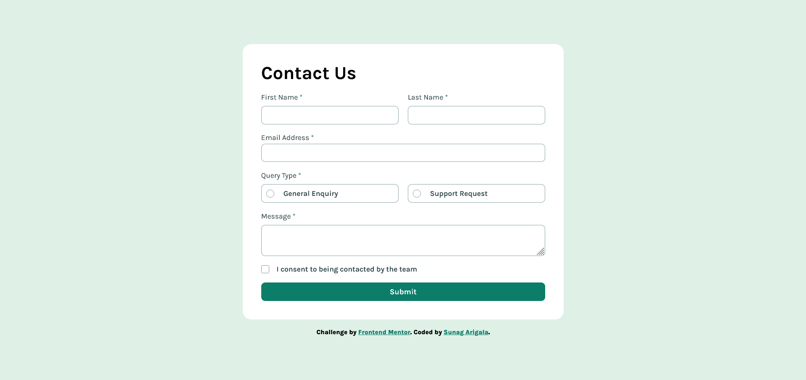
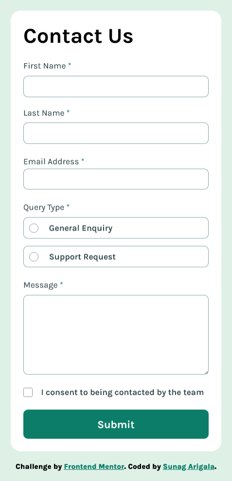

# Contact-form
HTML-CSS-JavaScript
# Frontend Mentor - Contact form solution

This is a solution to the [Contact form challenge on Frontend Mentor](https://www.frontendmentor.io/challenges/contact-form--G-hYlqKJj). Frontend Mentor challenges help you improve your coding skills by building realistic projects. 

## Table of contents
  - [The challenge](#the-challenge)
  - [Screenshot](#screenshot)
  - [Links](#links)
  - [Built with](#built-with)
- [Author](#author)


### The challenge

Users should be able to:

- Complete the form and see a success toast message upon successful submission
- Receive form validation messages if:
  - A required field has been missed
  - The email address is not formatted correctly
- Complete the form only using their keyboard
- Have inputs, error messages, and the success message announced on their screen reader
- View the optimal layout for the interface depending on their device's screen size
- See hover and focus states for all interactive elements on the page

### Screenshot





### Links
- Solution URL: (https://github.com/911Sunag/Contact-form)

### Built with

- Semantic HTML5 markup
- CSS custom properties
- Flexbox
- CSS Grid
- Mobile-first workflow


### What I learned

```js
radioBoxes.forEach((box, index) => {
  box.addEventListener("click", () => {
    
    radioOptions[index].checked = true;

    
    radioBoxes.forEach((b) => {
      b.classList.remove("active");
      b.querySelector("span").style.display = "none";
    });

    
    box.classList.add("active");
    box.querySelector("span").style.display = "block";

    
    radioError.style.display = "none";
  });
});
```
## Author
- Frontend Mentor - [@911Sunag](https://www.frontendmentor.io/profile/911Sunag)